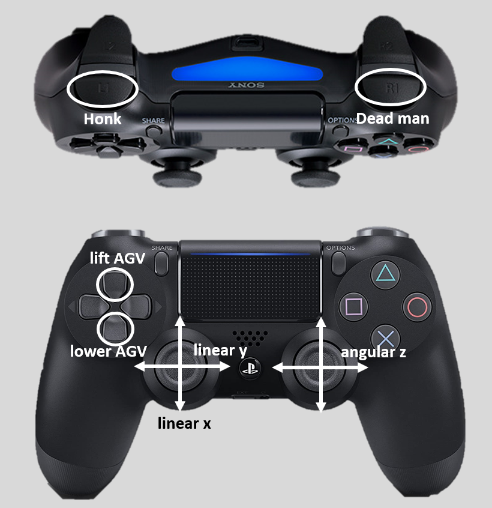

# AGV-EvoBot-ROS2

Manual control of the AGV via PS4 Controller using RIB communication

## Requirements
* RIB installed
* Docker installed
* Internet connection
* Tia project installed

If your system doesn't fulfill the requirements, please see chapter [Notes](#notes)

## Docker 
Image for the manual control of the EvoCortex AGV via RIB.<br/>
Included are all necessary packages to build the AGV-EvoBot-ROS2 Package.

Create the container with following commands, it's necessary to be in the directory of this repository:

```
cd agv-evobot-ros2-joy
docker build . -t ubuntu_foxy:manual_control
docker run -it --privileged --network host --group-add dialout --ipc="host" --name agv_control_joy ubuntu_foxy:manual_control
```
If necessary, the param ```--restart=always``` could be used, regarding to [restart policie](https://docs.docker.com/engine/reference/run/#restart-policies---restart).<br/>
The *run* command is just the first time necessary. After creating the container you have to start and enter it with:

```
docker start agv_control_joy
docker exec -it agv_control_joy bash
```

You're inside the container now. Enter following command:

```
ros2 launch evo_siemensrob_ctrl agv_control_launch.py
```

## Instructions
### Start of AGV
* Power the device with the battery
* Press the right top button right of the emergency button to start the Open Controller
* Connect with SSH on the device
* Connect Controller with AGV by pressing PS-Button (hold the controller close to the Open Controller)
* It's possible, that your AGV executes the 3 following tasks automatically. Please check this, before you try to start them manually!
* ```docker start agv_control_joy```
* ```docker exec -it agv_control_joy bash```
* ```ros2 launch evo_siemensrob_ctrl agv_control_launch.py```
* Press the right down button right of the emergency button to activate motorcontrollers
* Unlock emergency button
* Press dead man button (R1) and use Joysticks to control the AGV

### Restart of System
If you want to restart the evo_siemensrob_ctrl node (provides the RIB connection) or the PLC, you also have to restart the RIB. Therefore you have to enter following commands in a terminal of the host, **before you start the node again**. The following command will restart the PLC automatically. That's necessary to clear the shared memory of RIB.

```
sudo systemctl restart rib.service
```

### Shutdown of AGV
* Press emergency button
* ```docker stop agv_control_joy```
* ```sudo shutdown now```
* After shutdown press right top button right of the emergency button
* Remove battery

### Usage of PS4-Controller
The control described in following image is just possible, if the controller is paired (constantly blue light), the execution of the launchfile was succesfully and the plc is in run.<br/>
An instruction for pairing can be found here:<br/>
\\\ad456169pc.ad001.siemens.net\S_SUP\FA\960_SUP_SVS\30_Intralogistik\10_AGV\20_AGVs\Evocortex\04_Doku\BluetoothPairingPS4_documentation.pdf<br/>
**Use the bluetoothctl command with sudo!!**



## Notes
An image file, fulfilling the requirements, can be found here:<br/>
\\\ad456169pc.ad001.siemens.net\S_SUP\FA\1800_APC_Branch\02_BranchSupport\10_AGV\03_AcademicResearchPlatform\01_Theses\02_FY1920\02_Schadde\03_Code\02_RIB\01_Image\01_AGV

If you're using another image make sure you're following these instructions:\
Instructions for the installation of RIB and for the usage of the rib.service can be found here:
[Further instructions](https://code.siemens.com/simatic-systems-support/agv/ocp/rib)
